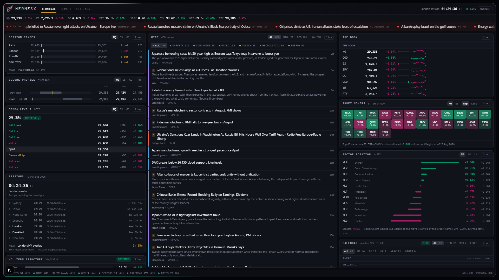
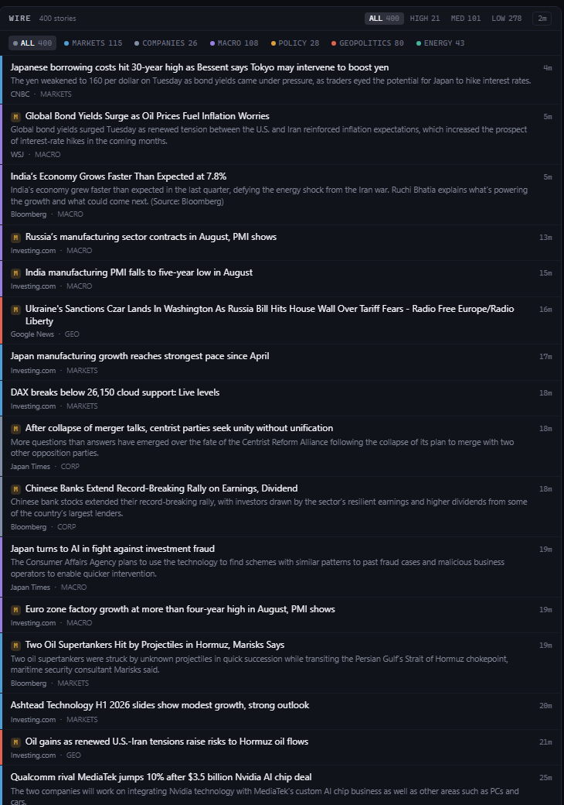
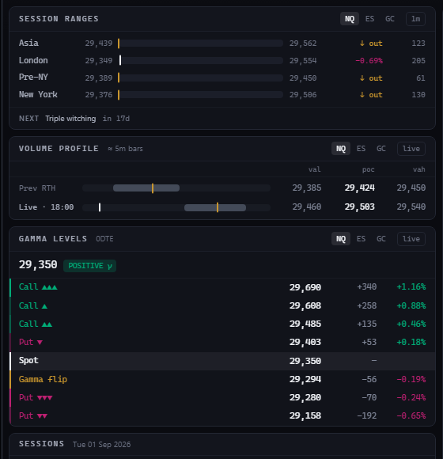
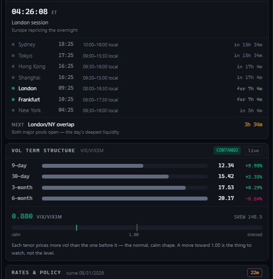
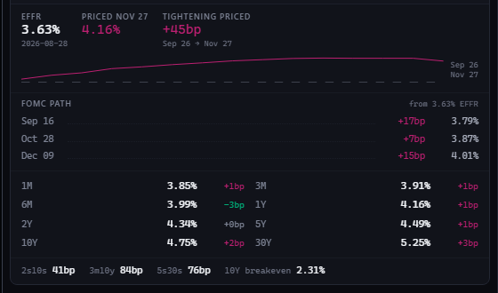
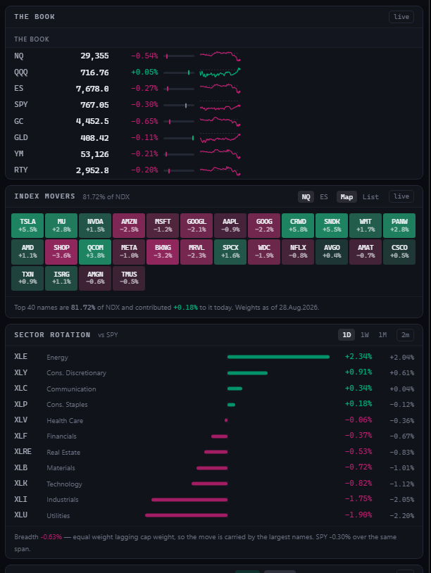
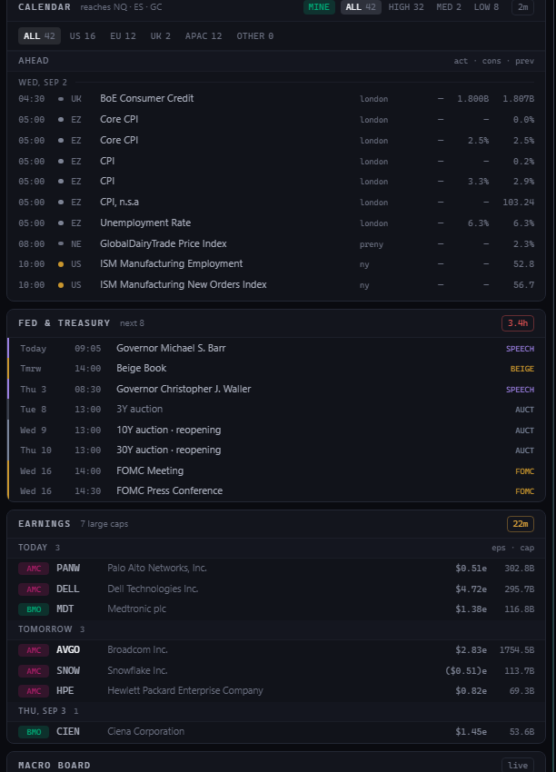
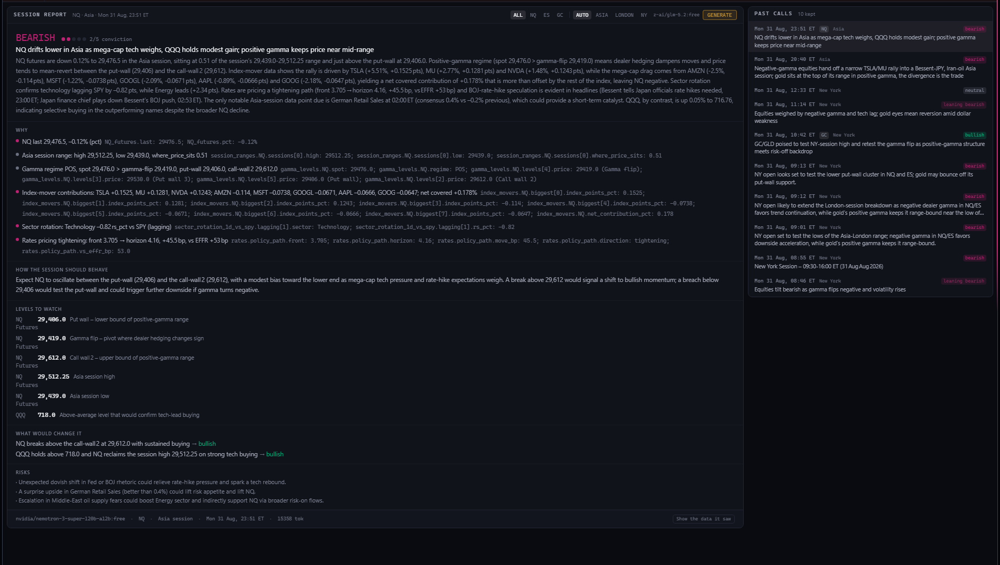
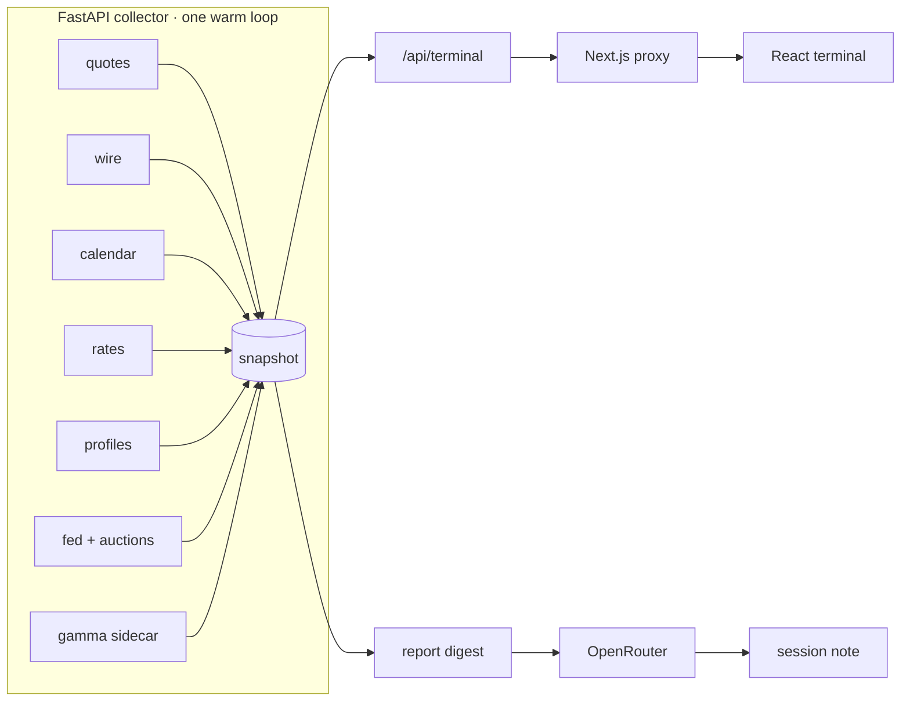

<div align="center">
  <h1>
    
    &nbsp;HermesX
  </h1>

  <p><strong>Financial Markets &amp; Macro News Terminal</strong> for trading Nasdaq,
  S&amp;P 500 and Gold futures across the Asia, London and New York sessions —
  a live news wire, sector rotation, dealer options positioning and gamma levels,
  the economic calendar, earnings, and a Fed &amp; Treasury diary — with
  <strong>AI-powered session reads</strong> built from facts the engine computed.</p>

  <p>
    
    
    
    
    
    
    
  </p>
</div>



---

## Why this exists

I trade **NQ, ES and GC** futures across the **Asia, London and New York** sessions.
Going into any of them, the questions are always the same: what happened while I was
away, what is scheduled to happen while I'm trading, where are the levels that matter,
and what regime am I stepping into? Answering that meant a dozen tabs — news sites, an
economic calendar, a rates page, a charting platform, an options dashboard.

HermesX folds all of it into one screen, in the spirit of an institutional terminal:
**everything states its own age, its own source, and its own limitations.** Every
figure that changes flashes. Every panel answers exactly one question. And an LLM
writes a session note at the end — but only from facts the engine has already
computed, never from vibes.

It is named for Hermes: god of messages, information and speed, which is the whole
job description.

---

## The screen

Three columns, one session clock.

| Column | Question it answers |
|---|---|
| **Left** | *Where are we?* — session ranges, volume profile, dealer gamma, the session clock, the vol curve, rates & the policy path |
| **Middle** | *What is happening?* — the wire: ~40 feeds, classified, deduplicated, impact-ranked |
| **Right** | *What is the market doing, and what's scheduled?* — the book, index movers, sector rotation, the economic calendar, Fed & Treasury diary, earnings, the macro board |

Above them: a live futures strip, and a crawl of only the **high-impact** headlines.
Below: a status rail showing every data source, its item count, and its freshness —
because a terminal that hides a dead feed is lying to you.

---

## The panels

### The Wire


~40 RSS and query feeds (Reuters, AP, Bloomberg, WSJ, FT, CNBC, Nikkei Asia, SCMP,
Japan Times, the ECB, the Bank of England, the RBA and more), merged into one tape:

- **Desk classification** — every headline lands on a desk: `markets`, `companies`,
  `macro`, `policy`, `geopolitics`, `energy`. Title-only classification, because
  summaries lie about what a story is.
- **Impact tiers** — `HIGH` is a thing that *happened* (a rate decision, a strike, a
  print landing); speculation about the same event is demoted. Filterable.
- **A relevance gate** — world-feed items must earn a place on a market tape.
  Police-blotter stories are dropped on every desk (a "home invasion" is not an
  invasion), unless the story touches a market figure — violence against a CEO has
  repriced a sector before.
- **Cross-feed dedupe** that keeps the desk that filed first, encoding repair for
  double-encoded publishers, and section-page detection for query feeds.

### Session ranges, volume profile & dealer gamma


The left column's core: three panels, one price ladder each, `NQ / ES / GC` pickers on all.

- **Session ranges** — what Asia, London, pre-NY and New York each traded, and where
  price sits inside every range. `↑ out` means the session's high has been taken out —
  the handover read.
- **Volume profile** — POC, VAH and VAL for three windows cut the way sessions are
  actually traded: the **previous RTH** (09:30–16:00 ET) as every session's reference,
  the **completed overnight** (18:00–09:30) once New York is trading, and a
  **developing profile** anchored at 18:00 ET through Asia/London and re-anchored at
  09:30 at the cash open. Each row draws its value area as a band, its POC as a tick,
  and live price as a marker. Built from 5-minute bars and labelled `≈` because that
  is what it is: zones, not ticks.
- **Gamma levels** — the seven prices where dealer hedging turns: three call walls,
  three put walls and the gamma flip for the **0DTE book**, with the regime badge
  (positive γ dampens moves; negative amplifies). Rank is drawn as chevrons —
  `▲▲▲` is the heaviest wall, not a footnote number. Sourced from a separate options
  analytics service over HTTP; if that service is down, this panel says so and shows
  nothing, because a stale gamma level is worse than none.

### The session clock & the vol curve


- **Sessions** — seven venues with local times and open/close countdowns, a phase
  headline (*"London session — Europe repricing the overnight"*) **derived from which
  desks are actually open**, not from a hardcoded table — so it can never contradict
  the rows beneath it, survives both hemispheres' DST changes, and the week is bounded
  by Globex (Sunday 18:00 ET is Monday morning, not the weekend). The NEXT marker
  counts down to real session moments — and shows an FOMC entry **only when the Fed's
  own calendar says there is one**.
- **Vol term structure** — VIX9D → VIX → VIX3M → VIX6M plus SKEW, with the
  VIX/VIX3M ratio drawn against 1.00: contango is the calm shape, backwardation the
  stressed one, and the crossover usually leads the index rather than following it.

### Rates, the policy path, and the FOMC meeting-by-meeting read


- The Treasury **curve** (1M→30Y) with daily basis-point changes, the classic spreads
  (2s10s, 3m10y, 5s30s) and the 10Y breakeven.
- The **fed funds futures strip** (15 months of ZQ contracts) rendered as the market's
  expected policy path.
- **FOMC path** — the strip un-mixed against the Fed's actual meeting dates into
  **basis points priced per meeting** (`Sep 16 +17bp → 3.79%`). Never "a 72% chance of
  a cut": probability framing needs an assumed move size, and this never assumes one.
  The one convention (day-count around mid-month decisions) is documented and tested.

### The book, index movers & sector rotation


- **The book** — NQ/QQQ, ES/SPY, GC/GLD, YM, RTY with day-range position bars and
  sparklines.
- **Index movers** — the top ~40 NDX/SPX names by **contribution** (weight × return),
  as a heat-map or ranked list, with the honest footer: how much of the index the
  shown names are, and what they added to it today. "NQ is down" and "NQ is down
  because two names are" are different facts.
- **Sector rotation** — the eleven S&P sector ETFs as **excess return vs SPY** (the
  only view that says anything on a day when everything is red), plus the breadth
  line: equal-weight against cap-weight, i.e. is this move the market or just its top.

### Calendar, Fed & Treasury diary, earnings


- **Economic calendar** — impact-scored, region-filterable (US/EU/UK/APAC), each event
  tagged with the trading session it lands in, and a `MINE` filter that narrows to
  releases that actually reach NQ, ES or GC. Three figures per row — `act · cons ·
  prev` — because markets move on the gap between actual and consensus, not on the
  number itself.
- **Fed & Treasury** — one diary of scheduled US rates risk: FOMC meetings, the Beige
  Book, governor speeches and testimony from the Board's own calendar, merged
  chronologically with **coupon auction supply** (3Y/10Y/30Y, reopenings named what
  the market calls them) from TreasuryDirect — because a tailed 30Y at 13:01 ET is an
  equity event for the longest-duration index on the board.
- **Earnings** — the coming week's large caps ($50bn+ and bellwethers), BMO/AMC
  tagged, estimates marked with an `e`, and actuals shown against the estimate and
  coloured by the surprise once they print.

### The AI session read


The Report tab generates a **session note** on demand: pick the session (Asia /
London / New York / auto-by-clock) and the book (NQ / ES / GC / all three), and the
collector assembles a structured digest of everything above — then an LLM (via
OpenRouter, with a model-and-mode fallback chain) writes the note. Its anatomy:

- **The call** — bias on the bear/bull scale with a 1–5 conviction, where a hedged
  read honestly held is worth more than a confident guess.
- **Why** — each driver quotes the exact digest fields it rests on
  (`gamma_levels.NQ.levels[2].price: 29406.0`), so every claim is auditable.
- **How the session should behave** — the regime read: what positive gamma at these
  walls, this rotation and this rates pricing usually does to the tape.
- **Levels to watch** — the handful of prices the note actually turns on, drawn from
  the gamma walls, the profile and the session ranges.
- **What would change it** — the invalidation: the prices and prints that flip the
  bias, stated before the session rather than rationalised after it.
- **Risks** — scheduled and unscheduled ways the read dies.
- **Past calls** — every prior note kept with its full digest attached, so any call
  can be audited against exactly the data it saw.

The design principle throughout: **the engine computes, the model narrates.**

- The digest is scoped to the chosen book — the instrument's own data is one block,
  everything else is explicitly `context_only`, because structure is obeyed where
  instructions are merely read.
- Headlines are re-weighted to the session's home region; the calendar block tags
  which events land inside the session being written.
- The volume-profile block states the market-profile reads **as computed facts**:
  each window's shape (P / b / D / double distribution), where the session *opened*
  relative to prior value, and where price trades *now* — above value, inside, or
  below. The model is told to cite the classifier's decisions, not to re-derive them.
- Every claim in the note must quote a figure from the digest; a hedged guess
  presented confidently is treated as worse than no note.

Reports persist to disk with their full digest attached, so any note can be audited
against exactly the data it saw.

### The chassis

Dark terminal aesthetic, three-hue discipline (a colour on a figure means calls,
puts, or the flip — decoration lives on its own tokens), an animated frame light,
a wordmark and helm that wash on one shared cycle, and a change-flash on every
figure that ticks: values glitch briefly in the product's own two hues when the
data moves. Themes are configurable, per-panel filters persist in `localStorage`,
and the whole board is keyboard-free by design — it is meant to be *read*.

---

## What it gathers

| Source | What | Cadence |
|---|---|---|
| Yahoo Finance (spark) | 50+ instrument quotes: futures, ETFs, FX, rates, vol complex, global indices, crypto | 20s |
| Yahoo Finance (chart) | 5-minute OHLCV bars for NQ/ES/GC → session ranges & volume profiles | 1–5 min |
| Publisher RSS + query feeds | ~40 feeds across six desks, region-tagged | 2 min |
| Nasdaq | Economic calendar (consensus/actual/previous) and the earnings calendar | 10 min |
| U.S. Treasury (yields) & fed funds futures | The curve, spreads, and the ZQ strip | 30 min |
| Federal Reserve (`calendar.json`) | FOMC dates, speeches, testimony, Beige Book | 1 h |
| TreasuryDirect | Upcoming coupon auctions | 6 h |
| iShares holdings CSVs | NDX/SPX constituent weights → contribution math | daily |
| A companion options-analytics service | The seven dealer-gamma levels per book, over HTTP | 30 s |
| OpenRouter | The session-note LLM (configurable model, fallback chain) | on demand |

Everything flows through one **warm-snapshot collector**: a single background thread
polls each source on its own cadence into memory; the API serves reads from that
snapshot and never blocks on a fetch. Slow sources can be stale — and say so — but
the terminal itself is always instant.



---

## Running it

Windows, Node 20+, Python 3.11+.

```powershell
npm install
cp .env.example .env.local     # add an OpenRouter key if you want session reports
.\dev.ps1                      # both halves, each in its own window
```

- Web: **http://localhost:3100** · Collector: **http://127.0.0.1:8100**
- `.\server\run.ps1` starts the collector alone — its window *is* the feed log: one
  row per source per refresh, with ages and item counts. Always start it through the
  script; it is what loads `.env.local`.
- The gamma panel reads a companion options service on `:8000`; without it, that one
  panel reports itself unavailable and everything else runs normally.

Checks: `npm run check` runs TypeScript, ESLint, Ruff, mypy (strict) and the pytest
suite — 135 tests, most of them regression tests bought with a real observed bug:
the classifier rules, the FOMC un-mixing, the profile session windows, the JSON
extractor's four observed wrappings.

---

## Honest limitations

- **Personal-use data.** The quote and news sources here are free feeds that are fine
  to read at one desk and are **not redistributable**. This repository is published as
  code; if you deploy it for anyone but yourself, replace `server/newsterminal/sources/quotes.py`
  and `wire.py` with licensed sources first. That constraint shaped the design and is
  a feature of it, not an oversight.
- **Volume profiles are approximate** — built from 5-minute bars, labelled `≈` in the
  UI, and intended as context. Execution-grade profiles belong to tick data.
- **Free-tier LLMs are flaky.** The report chain retries across models and modes,
  parses JSON out of four kinds of wrapper, and fails loudly with the full attempt
  trail when the pools are saturated.
- **Desktop-width layout** (≥1280px). It is a terminal; it assumes a monitor.

---

## The mark

The winged helm is my own line art. In the app it lives as a single traced vector
path (`src/lib/hermesMark.ts`), recoloured live to the terminal's chrome hues — the
favicon and the header render from the same path, so the tab and the page are one
identity.
